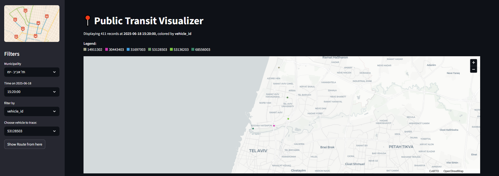

# 📍 Public Transit Visualizer
This Streamlit app simulates a real-time tracking system for public transport using the SIRI-SM protocol. It displays live vehicle positions on a municipal map, allows filtering by time, line, speed, or operator, and supports tracing individual vehicle routes. The bundled demo SQLite database contains 1,000,000 records ingested from SIRI API responses collected on June 18, 2025.

  
*Figure 1: Main map view with real-time vehicle dots and legend.*

  
*Figure 2: Route tracing for a selected vehicle.* 

# Features
- Live Data Simulation - mimics real-time SIRI-SM transit data ingestion
- Interactive Map - pan, zoom, and hover tooltips powered by Deck.gl
- Time Filtering - select any recorded timestamp from June 18, 2025
- Attribute Coloring - color by vehicle ID, line ID, speed, or operator ID
- Route Tracing - view start, intermediate, and end pings for any vehicle
- Data Table - inspect raw data points (ID, time, speed, bearing, coordinates)

