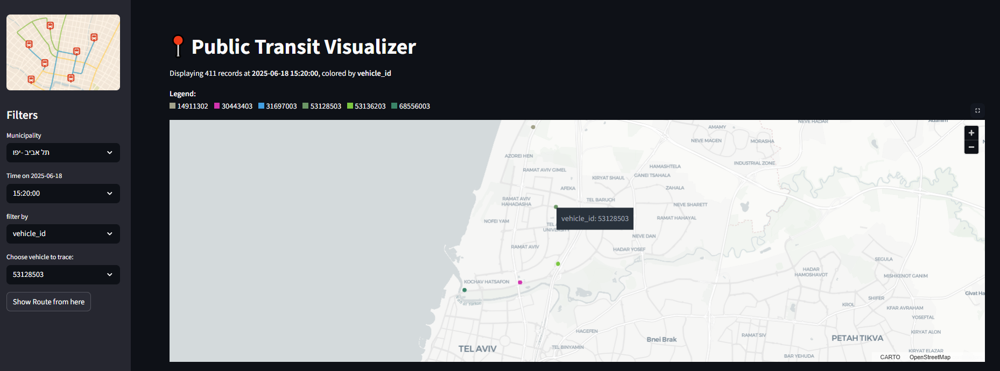
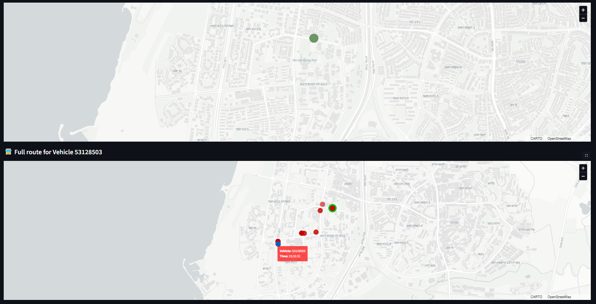

# 📍 Public Transit Visualizer
This Streamlit app simulates a real-time tracking system for public transport using the SIRI-SM protocol. It displays live vehicle positions on a municipal map, allows filtering by time, line, speed, or operator, and supports tracing individual vehicle routes. The bundled demo SQLite database contains 1,000,000 records ingested from SIRI API responses collected on June 18, 2025.

# Data Processing
1. Created the SQLite DB by parsing multiple SIRI API response JSON files with a custom script to extract the needed fields.
2. Loaded the DB and GeoJSON, then filtered vehicle pings by municipality and selected timestamp.
3. Applied color‐coded filters on line_id, operator_id, vehicle_id, or speed.
4. Queried and displayed the full route for a chosen vehicle within the current municipality.

# Technologies

    
  &emsp;
    
  &emsp;
    
  &emsp;
    
  &emsp;
    
  &emsp;
    

---

[Click here to view the live demo](<https://public-transit-visualizer.streamlit.app/>)

  
*Figure 1: Simulation of real-time vehicle positions on the municipal map.*

  
*Figure 2: Route tracing for a selected vehicle.*